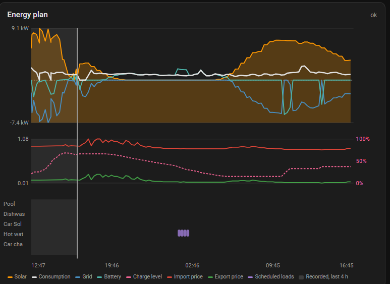
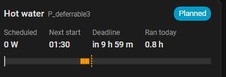

# Dashboard cards

Two cards ship with the integration and register themselves — no separate
HACS install, and no way for the cards and the integration to drift to
different versions.

**`custom:emhass-plan-card`** — the whole plan in one view: solar as a filled
area, consumption and grid as lines, battery charge level and both prices
below, and a row per deferrable load showing when it is scheduled to run. A
vertical marker shows *now*.



```yaml
type: custom:emhass-plan-card
```

**`custom:emhass-deferrable-card`** — one deferrable load: whether it should
run now, its scheduled power, next start, runtime today, a timeline of its
schedule, and the day-to-day controls — **Run now**, and on an on-demand or
surplus load **Requested** with its deadline or energy cap.

**Enabled** is deliberately not on the card. Turning it off takes the load out
of the optimisation entirely, which is a setup decision rather than a daily
one, and a switch that far-reaching does not belong under a thumb on a card
that gets tapped every day. The header still reads "Disabled" while it is off,
and the switch is on the load's own device page.



```yaml
type: custom:emhass-deferrable-card
load: Dishwasher    # omit to show the first load
```

Both find their entities through the entity registry rather than by guessing
entity ids, so renaming an entity does not empty the card. Neither takes any
configuration beyond the above.

They are drawn as inline SVG with no charting library and no build step, and
they use Home Assistant's energy-dashboard CSS variables, so they follow your
theme in both light and dark mode.

> If you manage Lovelace resources in YAML rather than through the UI, the
> integration cannot register the module for you. It logs the exact snippet to
> add at startup; look for it in the log after a restart.
