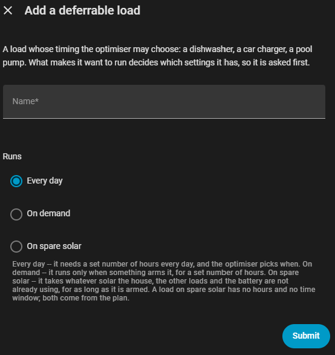

# Deferrable loads

A deferrable load is anything whose *timing* the optimiser may choose: a
dishwasher, a car charger, a pool pump. Tell it the load needs three hours
before morning and it decides which three.

Add them under **Settings → Devices & Services → EMHASS Companion → Add
deferrable load**. Each becomes its own device, with its own entities, added
and removed independently.



**Runs** is asked before anything else, because it decides which other
settings the load even has — see [on-demand loads](on_demand_loads.md) and
[surplus loads](surplus_loads.md) for the other two.

Setup asks only for things that rarely change — power, hours, whether it runs
at full power or can be modulated, whether it may be interrupted. Everything
you might change day to day becomes a control on the load's own page:

| Entity | |
|---|---|
| `binary_sensor.<load>_should_run` | **The one to automate against.** Unknown rather than off when there is no usable plan |
| `binary_sensor.<load>_running` | What the load is actually observed doing right now, from its power sensor or control entity. Off (not unknown) when there is nothing to observe |
| `sensor.<load>_scheduled_power` | Planned power now, with the full schedule in its `schedule` attribute |
| `sensor.<load>_next_start` | When it is next due to start |
| `sensor.<load>_runtime_today` | How long it has run today |
| `switch.<load>_enabled` | Include this load in the optimisation at all |
| `switch.<load>_restrict_to_a_time_window` | Whether the window below applies |
| `time.<load>_earliest_start` / `_latest_finish` | The window. May cross midnight |
| `number.<load>_power_when_running` / `_hours_needed_per_day` | |
| `number.<load>_minimum_on_time` / `_minimum_off_time` | Protects compressor-driven loads from short-cycling — see below |
| `button.<load>_run_now` | Run this load immediately, regardless of recurrence |

Two distinctions worth knowing, because conflating either causes confusion:

**Run now overrides the signal, not the plan.** Pressing it makes
`should_run` on immediately, but EMHASS still solves the rest of the plan
around its own schedule for the load, which is why it only asks for *more*
than the plan already accounts for — it clears itself once the load's
configured hours for the day are met, and there is deliberately no equivalent
"force off": that would leave the rest of the plan solved as if the load were
still running. To leave a load out of planning entirely, turn off its
**Enabled** switch instead. Keeping these separate means pausing a load never
silently changes the problem being solved.

**A power sensor is optional but worth adding.** With one, the integration
can tell EMHASS the load is already running — so it is not charged a
start-up cost twice, and is not asked to repeat work it has already done
today. Runtime is counted from that sensor and reset at local midnight,
because EMHASS has no notion of a day boundary for it.

Automating against a load looks like:

```yaml
triggers:
  - trigger: state
    entity_id: binary_sensor.dishwasher_should_run
    to: "on"
actions:
  - action: switch.turn_on
    target:
      entity_id: switch.dishwasher
```

## Recurrence: daily vs on-demand

By default a load wants its configured hours every single day. Some loads
don't work like that — a hot water tank only needs heating once its
temperature has dropped, a dishwasher only after someone has loaded it.
Switch `select.<load>_recurrence` to *On demand* and the load wants nothing
until something arms it via `switch.<load>_requested` — typically an
automation reacting to a sensor or a button press. The load then enters the
plan until its hours are met, at which point the switch turns itself off.
An unfulfilled request survives past midnight, so a dishwasher loaded late
at night still runs in the cheap early-morning hours.

See [on_demand_loads.md](on_demand_loads.md) for the full mechanics, including
optional deadlines ("run within N hours").

`select.<load>_recurrence` actually has a third position, *On spare solar* —
see [surplus_loads.md](surplus_loads.md) for what that changes.

## Thermal loads

A thermal load is a variant whose *temperature* the optimiser controls rather
than its run time: a heat pump, direct electric heating, an air conditioner.
See [thermal_loads.md](thermal_loads.md) for the full detail and calibration
advice.

## Surplus loads

A load that only ever wants energy which would otherwise leave the house —
the motivating case is a pool heater. See [surplus_loads.md](surplus_loads.md).

## Minimum on/off time

`number.<load>_minimum_on_time` / `_minimum_off_time` give a compressor-driven
load (a heat pump, a freezer) a minimum dwell time once it switches on or off,
so the plan cannot ask it to cycle faster than the hardware allows. Both
default to zero (no minimum). They only apply to a daily or on-demand load —
a load on spare solar has no hard timing constraints, for the same reason it
has no maximum-startups setting: a broken-cloud day can make a hard timing
requirement infeasible against a run window the plan itself derives.

Sent to EMHASS as `def_minimum_on_time` / `def_minimum_off_time`, in the same
per-timestep units as the rest of the `def_*` settings. Each run also reports
back how long the load has already been continuously on or off, as
`def_current_on_timesteps` / `def_current_off_timesteps`, so a dwell time in
progress is still honoured correctly across restarts rather than resetting to
zero on every solve.

## Load groups

Two or more loads can share a circuit — a subpanel or fuse limit, or an EV
charger and an immersion heater that must never run together. See
[load_groups.md](load_groups.md).
