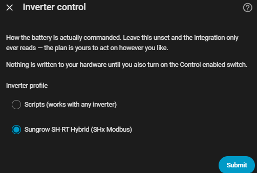

# Inverter control

This is what lets the integration actually charge or discharge your
battery, instead of only telling you what it would do. It's optional and
off by default — see [Handing over control](#turning-it-on) below before you
turn it on.

Configure it under **Settings → Devices & Services → EMHASS Companion →
Configure → Inverter control**.

## Inverter control step

- **Inverter profile** — how the battery is actually commanded:
    - **Scripts (works with any inverter)** — you provide a script for each
      action (self-consume, charge, discharge, idle); the integration calls
      whichever one applies.
    - **Sungrow SH-RT Hybrid (SHx Modbus)** — a ready-made profile for
      Sungrow SH-RT inverters via the mkaiser Modbus package.
    - Leave it unset and the integration only ever reads — nothing is ever
      written to your hardware.

You'll then be asked to confirm a handful of entities the chosen profile
needs (a select, a number, a script — whatever that profile's hardware
uses).

## Entities

- **Mode** (select) — *Automatic* / *Self-consumption* / *Force charge* /
  *Force discharge* / *Idle*. Anything other than *Automatic* takes the
  optimiser out of the loop and holds that mode until you change it back.
- **Control enabled** (switch) — the master switch on acting at all. **Ships
  off.**
- **Battery action** (sensor) — what the integration did, or would have
  done, this cycle, and why.

## Turning it on

Leave **Control enabled** off for a while first. With it off, the
integration still runs every cycle and records what it *would* have done on
**Battery action** — so you can compare its judgement against your existing
automations before switching over. Once you're happy with what you see,
turn **Control enabled** on and retire your old automations.
