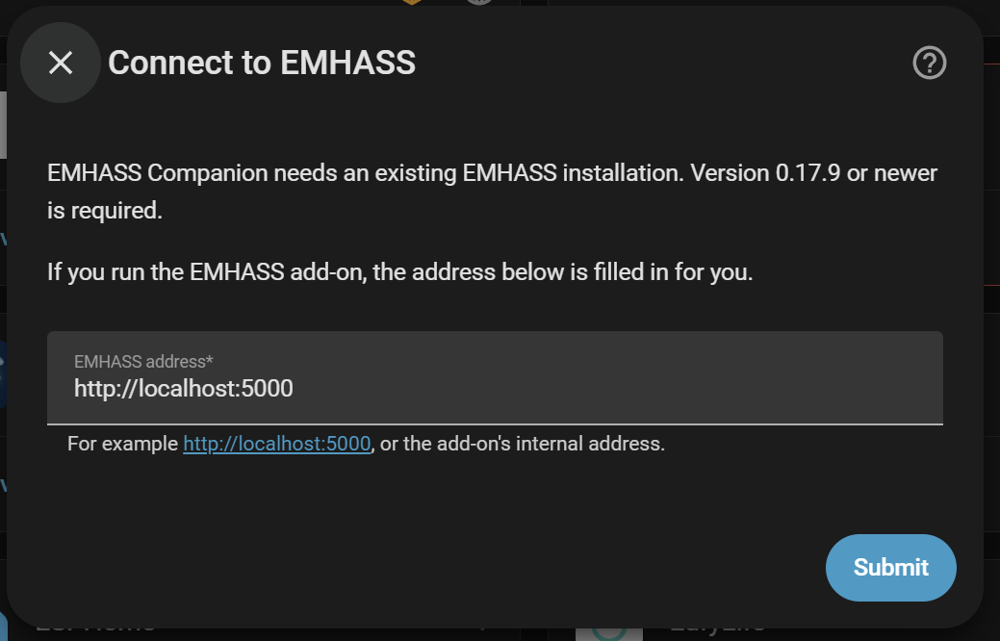
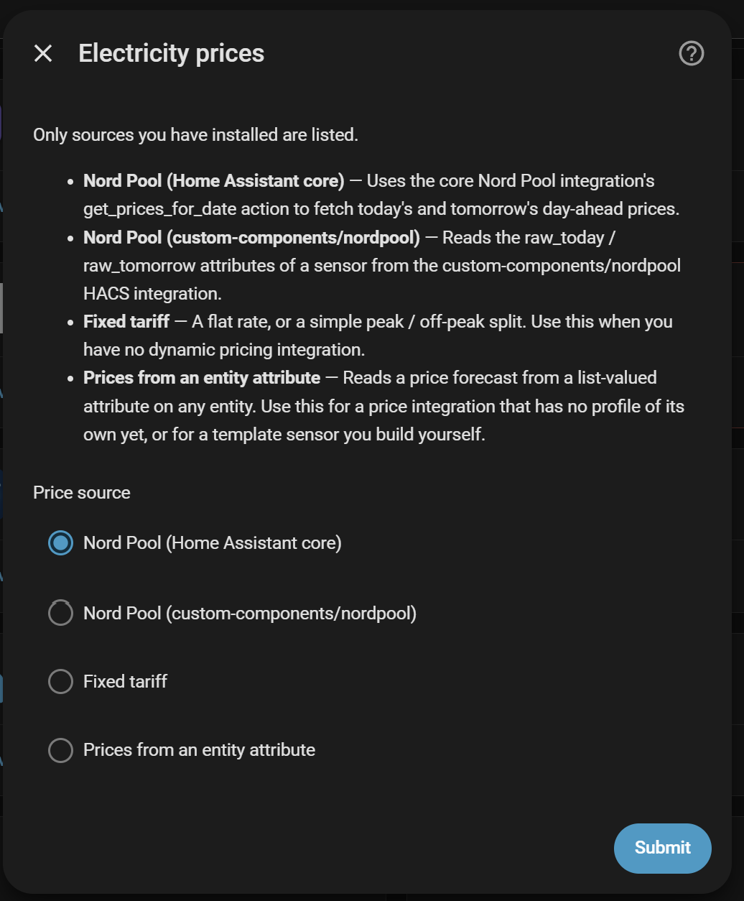
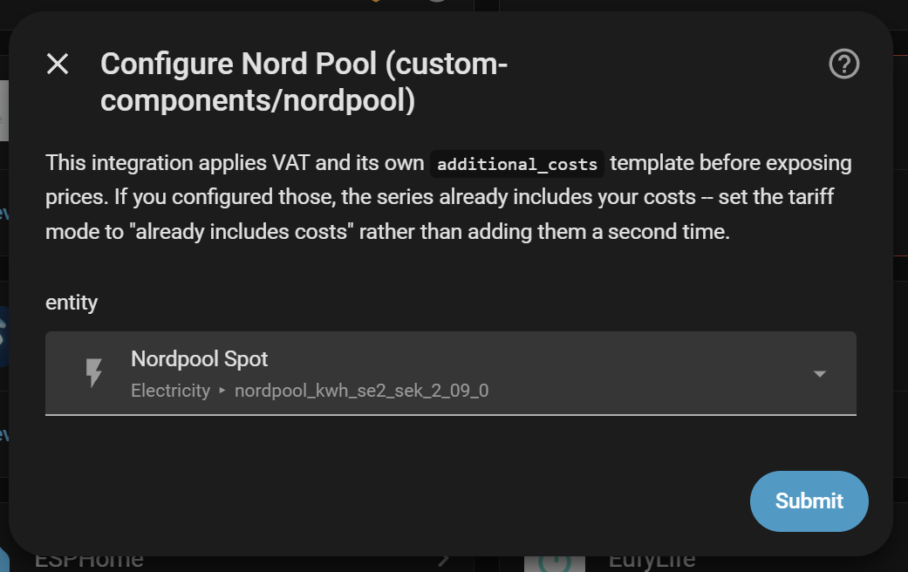
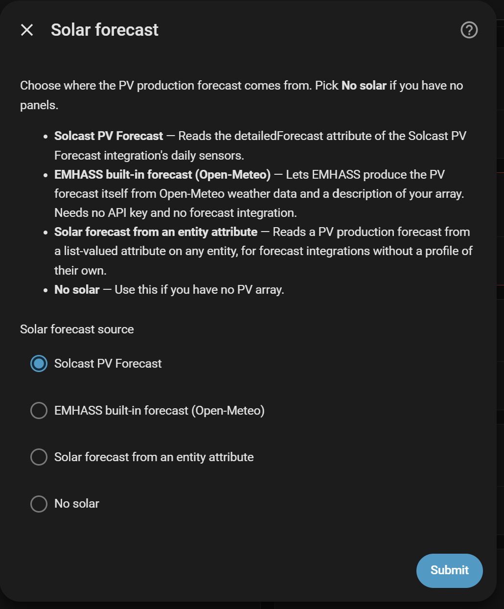
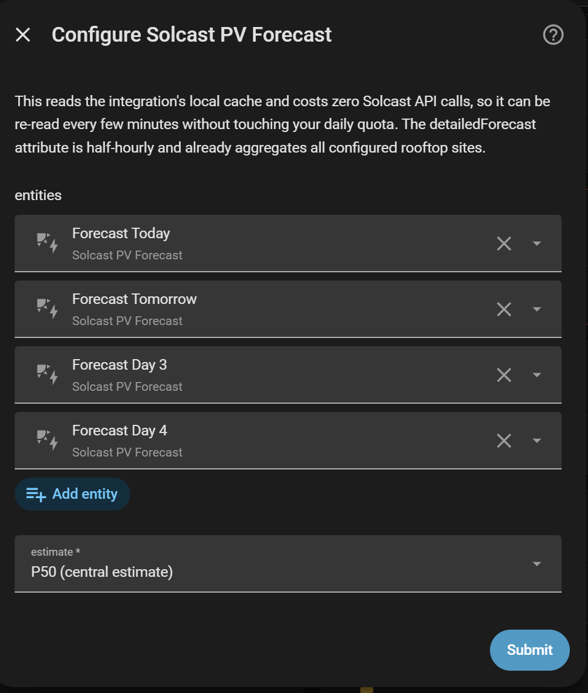
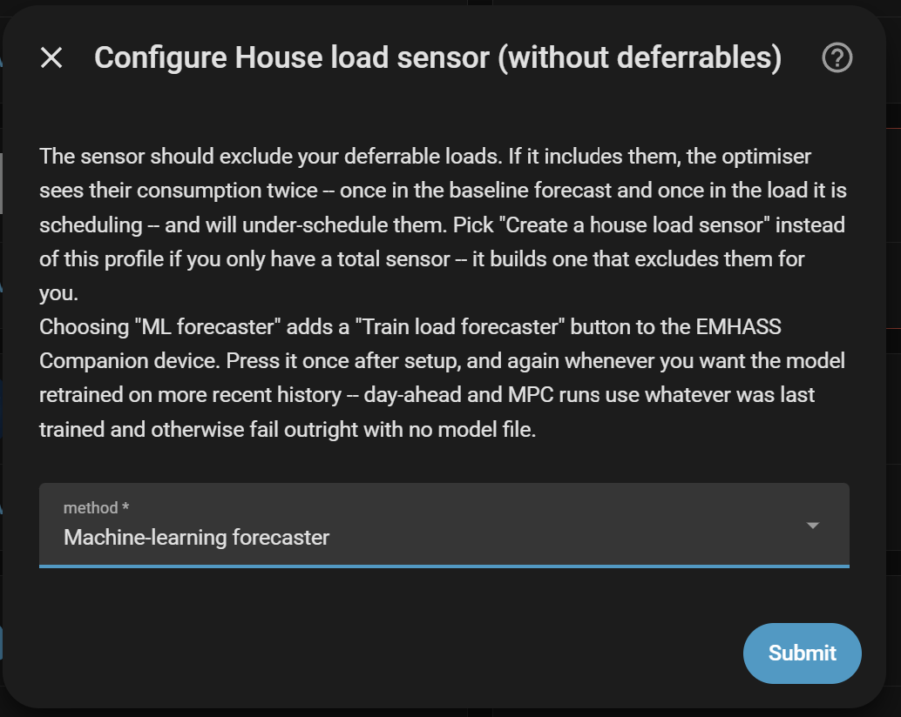

# Setup

When you add the integration, it asks a handful of questions, one screen at
a time. It only ever offers choices that match integrations you actually
have installed.

Every screen is listed below field by field, in the order it appears.

## 1. Connect

- **EMHASS address** — where EMHASS is running, for example
  `http://192.168.1.10:5000`. Filled in for you if you use the add-on.
  `localhost` won't work: it only reaches Home Assistant's own container.

## 2. Electricity prices

- **Price source** — pick the one that matches what you have installed.
  Sources you don't have installed aren't listed at all:
    - **Nord Pool (Home Assistant core)** — uses the core Nord Pool
      integration's `get_prices_for_date` action to fetch today's and
      tomorrow's day-ahead prices.
    - **Nord Pool (custom-components/nordpool)** — reads the `raw_today` /
      `raw_tomorrow` attributes of a sensor from the HACS Nord Pool
      integration.
    - **ENTSO-E** — reads the `prices` attribute of the ENTSO-E
      integration's average-price sensor.
    - **Tibber** — asks Tibber for the price series of one of your homes.
    - **Amber Electric** — uses the core Amber Electric integration's
      `get_forecasts` action to fetch the AEMO wholesale price.
    - **Amber Express** — reads the `forecast` attribute of a price sensor
      from the Amber Express custom integration.
    - **Fixed tariff** — a flat rate, or a simple peak/off-peak split. Use
      this when you have no dynamic pricing integration; it fetches nothing
      and needs none.
    - **Prices from an entity attribute** — reads a price forecast from a
      list-valued attribute on any entity. The escape hatch for a price
      integration with no profile of its own, or a template sensor you build
      yourself.

> Don't see your integration? You're not stuck with this list — see
> **[Template additions](../template_additions.md)** to add your own price
> source.

### Configuring the price source

The next screen asks for whatever that particular source needs, and nothing
else:

- **Nord Pool (Home Assistant core)** — **Nord Pool configuration** (which
  config entry to read) and **Price area** (the bidding zone, for example
  `SE3` or `NO1`). Prices come back per MWh and are scaled to per kWh for
  you.
- **Nord Pool (custom-components/nordpool)** — **Nord Pool sensor**, the one
  exposing `raw_today` / `raw_tomorrow`. This integration applies VAT and its
  own `additional_costs` template itself, so if you configured those, set the
  import method on the next screen to *Already includes costs* rather than
  adding them a second time.
- **ENTSO-E** — **ENTSO-E sensor**, usually the "Average price" one, since
  that's the sensor carrying the full `prices` attribute. Whether the values
  already include VAT depends on the ENTSO-E integration's own VAT setting.
- **Tibber** — **Home name**, exactly as it appears in the Tibber app.
  Tibber returns the *total* price, VAT, taxes and grid fees included, so use
  *Already includes costs* on the next screen.
- **Amber Electric** — **Amber Electric account** (which config entry),
  **Channel** (General, Feed-in or Controlled load) and **Price field**:
  `spot_per_kwh`, the raw AEMO wholesale price (the default, use ordinary
  tariff settings to build up from it), or `per_kwh`, Amber's own all-in
  price for that channel (use *Already includes costs*).
- **Amber Express** — **Amber Express price sensor**, the channel's price
  sensor from the Amber Express custom integration. Its `forecast` values
  already include fees, network charges and Amber's margin, so use *Already
  includes costs*.
- **Fixed tariff** — **Peak price** and **Off-peak price** (import price per
  kWh in each period), **Peak period start** / **Peak period end** (when the
  peak rate applies) and **Export price** (what you're paid per kWh
  exported).
- **Prices from an entity attribute** — **Price entity**, **Attribute name**
  (the attribute holding the list, for example `raw_today`), **Second
  attribute** (optional — many integrations split today and tomorrow across
  two attributes), **Timestamp field** and **Price field** (the keys inside
  each record), and **Scale factor** (a multiplier to reach a price per kWh;
  use `0.001` if the source is priced per MWh).

## 3. Buy and sell prices

Your price source gives raw spot prices. This step turns that into what you
actually pay or get paid, for import and export separately:

- **Import price method** — how your buy price is built: *Linear*
  (multiply, then add), *Already includes costs* (use the price as-is), or
  *Template* (write your own formula).
- **Import multiplier** — multiplies the spot price. Use for VAT — `1.25` for
  25%.
- **Import addition per kWh** — a flat amount added after the multiplier. Use
  for grid fees, energy tax, supplier markup.
- **Import template** — only used if you picked *Template* above. `spot` and
  `time` (your local time) are available.
- **Export price method / multiplier / addition per kWh / template** — the
  same four questions, for what you're paid when selling back to the grid.

## 4. Solar forecast

- **Solar forecast source**:
    - **Solcast PV Forecast** — reads the `detailedForecast` attribute of the
      Solcast integration's daily sensors.
    - **EMHASS built-in forecast (Open-Meteo)** — EMHASS produces the
      forecast itself, from Open-Meteo weather data and a description of your
      array. No API key, no forecast integration needed.
    - **Solar forecast from an entity attribute** — reads a PV production
      forecast from a list-valued attribute on any entity.
    - **No solar** — if you have no PV array. Nothing further is asked, and
      the optimiser works on tariff and battery arbitrage alone.

> Don't see your integration? You're not stuck with this list — see
> **[Template additions](../template_additions.md)** to add your own solar
> source.

### Configuring the solar source

- **Solcast PV Forecast** — **Forecast sensors** (today and tomorrow cover
  the optimisation horizon; the later days let End SOC's *Optimized* mode see
  past it) and **Confidence level**: *P50* is the central estimate, *P10* is
  pessimistic — which biases the plan towards importing rather than assuming
  sun that may not arrive — and *P90* is optimistic. Reading is local and
  costs no Solcast API calls, so selecting more sensors than you need costs
  nothing.
- **EMHASS built-in forecast (Open-Meteo)** — **Array peak power** (total DC
  peak power of your panels, in W), **Inverter AC power** (in W), **Panel
  tilt** (0 horizontal, 90 vertical) and **Panel azimuth** (0 north, 90 east,
  180 south, 270 west).
- **Solar forecast from an entity attribute** — **Forecast entities** (select
  every entity needed to cover your planning horizon), **Attribute name**,
  **Timestamp field**, **Power field** and **Scale factor** (values must end
  up in watts, so use `1000` if the source reports kW).

Changeable later under **Configure → Solar forecast**, source and all. Worth
revisiting after an update: a source's default entity list can gain entries,
and those are offered there rather than applied for you. Solcast users should
add `sensor.solcast_pv_forecast_forecast_day_3`, which lets
[End SOC](../end_soc.md)'s *Optimized* mode see the next solar day past
the horizon instead of inferring it from the previous day.

## 5. House consumption

- **Load forecast source** — how EMHASS should predict your household's
  baseline load:
    - **Create a house load sensor** — pick this if the only thing you
      measure is *total* house power. It builds you a new sensor that keeps
      that reading minus whatever your deferrable loads are drawing at any
      moment, and forecasts from that.
    - **Typical household profile (no sensor needed)** — a generic daily
      shape, scaled to an average power you type in. Least accurate, but
      works with no sensor at all.
    - **Load forecast from an entity attribute** — for when you already
      generate a load prediction elsewhere and want EMHASS to consume it
      rather than forecast for itself.
    - **House load sensor** — most accurate, if you have one that already
      excludes your own deferrable loads.

### Configuring the load source

- **Create a house load sensor** — **Total house power sensor** first. It
  should exclude the *battery's* own charge/discharge power, which EMHASS
  plans separately. Then the same **Forecast method** question as below.
- **House load sensor** — **House load sensor** (power consumption excluding
  deferrable loads) and **Forecast method**:
    - *Typical daily profile* — a generic daily shape.
    - *Naive (repeat yesterday)* — repeats the last day. Suits stable
      households.
    - *Machine-learning forecaster* — trains on your own history and is the
      most accurate, but must be trained before first use. Picking it adds a
      **Train load forecaster** button to the EMHASS Companion device; press
      it once after setup, and again whenever you want the model retrained on
      more recent history.
- **Typical household profile** — **Average power**, your household's typical
  average draw in watts. The generic shape is scaled so its own average
  matches it. A rough starting point: last year's bill in kWh, divided by
  8760, times 1000.
- **Load forecast from an entity attribute** — **Forecast entity**,
  **Attribute name**, **Timestamp field**, **Value field** and **Scale
  factor** (use `1000` if the values are in kW).

## 6. Battery

Leave **I have a battery** off if you don't have one — everything else on
this screen is then ignored.

- **Usable capacity** — in Wh.
- **Maximum charge power** / **Maximum discharge power** — the battery's own
  limits, in W.
- **Shared inverter (hybrid)** — on if PV and the battery share one
  inverter's AC-side limit (most home systems). Off if they're two separate
  inverters.
- **Maximum AC output (discharge/export)** / **Maximum AC input
  (charge/import)** — only asked if hybrid; the shared inverter's own
  ceiling.
- **DC to AC efficiency** / **AC to DC efficiency** — conversion losses.
- **Discharge cycle cost** / **Charge cycle cost** — what a kWh through the
  battery costs you in wear, in the same currency as your prices. The
  optimiser charges it against the profit it's chasing, so the battery only
  cycles when the price spread beats the wear. Both default to 0 (cycle
  freely); around 0.02–0.10 per kWh on the discharge side is a reasonable
  starting point. Set one of the two, not both — see
  [Setup reference](../setup.md#battery).
- **Low charge comfort level** / **Cost of sitting below it** — a soft
  preference for keeping a reserve, priced per kWh below the level per hour
  spent there. Unlike Minimum charge level this can be crossed when it's
  clearly worth it.
- **High charge comfort level** / **Cost of sitting above it** — the mirror
  image: sitting full ages the battery, so this makes the plan fill it late
  rather than early. Both costs default to 0, which leaves the pre-filled
  40%/90% levels doing nothing.
- **Stress cost detail** — how finely the stress cost curve below is
  approximated. 10 is a good balance; only matters if the stress cost is set.
- **High-power stress cost** — discourages fast charge/discharge. The cost
  grows with the square of the power, so the plan spreads a charge over
  several hours rather than forcing it into the cheapest one. 0 by default.
- **Minimum charge level** / **Maximum charge level** — the range the
  optimiser is allowed to plan within. Hard bounds, unlike the comfort
  levels above.
- **Target charge level** — where it aims to leave the battery at the end of
  the plan. What it means depends on **End SOC** below: with *Optimized* it's
  the reserve floor the computed target never plans below; with *Fixed %
  slider* it's the exact level aimed for.
- **End SOC** — how that end-of-horizon level is chosen:
    - *Optimized* — computed fresh each run from the solar, price and load
      forecasts beyond the horizon.
    - *Same as start* — always plans back to whatever level the battery is
      at now.
    - *Fixed % slider* — always aims for **Target charge level** above.

    Requires EMHASS 0.18 or newer. See **[End SOC](../end_soc.md)** for
    how *Optimized* decides.
- **Self-consumption handoff threshold** — how close to zero the grid power
  needs to be before the battery is handed back to plain self-consumption
  instead of a forced charge/discharge. Once handed over, grid power must
  exceed *twice* this value before the plan can force the battery again, so
  it doesn't flip modes every recalculation.
- **Battery SOC sensor** — read at the start of every plan.
- **Battery power sensor** — optional, and nothing in the optimisation
  reads it: EMHASS *plans* battery power rather than measuring it. The
  dashboard cards draw it against the plan, and answering it once here is
  what stops each card asking for the same sensor separately.
- **That sensor is positive when charging** — leave off for the usual
  convention, positive while discharging, which is the plan's own. This is
  the answer the cards cannot work out for themselves, which is why a card
  pointed straight at a sensor shows only magnitude.
- **Live PV power sensor** — optional. Its current reading is blended into
  the first step of every model-predictive PV forecast, weighted by the
  **Live value weight** number on the hub device. Load is blended the same
  way automatically when the load source is *House load sensor*.

## 7. Inverter control

Optional — leave the profile blank and the integration only ever reads, and
the plan is yours to act on however you like. Pick a profile and you're asked
for the entities it needs; nothing is written to your hardware until you also
turn on the **Control enabled** switch afterwards.

It comes before the grid step because the next step asks whether EMHASS
should plan PV curtailment, and that only pays off if something can carry the
plan out — which is a property of the profile you pick here.

See **[Inverter control](inverter_control.md)** for what each profile can do,
and for writing your own if yours isn't listed.

## 8. Grid and schedule

- **Maximum import power** / **Maximum export power** — your connection's
  limits, in W.
- **Import limit sensor** / **Export limit sensor** — leave empty unless your
  usable limit moves. Point them at a sensor giving the limit in W right now
  and it's used instead of the fixed number above. The common reason is a
  three-phase connection with uneven phase loading, where the fixed number
  overstates what you can actually draw — see
  [Dynamic grid limits](../grid_limits.md) for the template. A sensor can only
  ever lower the fixed limit, never raise it.
- **Capacity (demand) charge** — only for network tariffs that bill your
  highest power draw, not just your energy. Enter the price per kW and the
  plan flattens its worst import peak instead of only chasing cheap hours.
  Charged once on the peak, not per hour. 0 by default, and it works with or
  without a battery.
- **Let EMHASS optimise PV curtailment** — off by default. Turn it on and
  EMHASS may shed solar it can't use profitably, and the plan gains a
  curtailment column for an inverter profile to follow. Only worth it if
  something can act on it: without a curtailment-capable inverter profile the
  plan assumes solar was shed that in reality still goes to the grid.
  Negative sell prices are part of what it weighs: with this on, EMHASS
  decides for itself when exporting into a negative price is worse than
  shedding, and when it isn't.
- **Time resolution (minutes)** — how finely the plan is divided. Filled in
  automatically to match your price source (15 minutes for current Nord Pool
  prices, 60 for most others). Pick from the list or type any number of
  minutes; a coarser step solves faster.
- **Recalculate every** — how often the plan is re-optimised, in minutes.
- **Planning horizon** — how many hours ahead it plans.
- **Day-ahead fallback time** — backup time for the once-a-day full
  re-plan, in case new prices haven't shown up yet.

## Changing your mind later

Most of these can be revisited any time from **Settings → Devices &
Services → EMHASS Companion → Configure**:

The menu holds **House consumption**, **Solar forecast**, **Battery**, **Grid
and schedule**, **Buy and sell prices**, **Inverter control** and **Outdoor
temperature** — the same screens as above, plus one more:

**Outdoor temperature** is only worth visiting once you have a thermal load —
see **[Thermal loads](thermal_loads.md)**. **Inverter control** is the same
step you saw during setup, so this is where you go to add a profile you
skipped, or to swap one.

The electricity price source is the one exception — changing which *source*
you use means removing and re-adding the integration, since it decides which
other questions even apply.

To move EMHASS itself to a different address, use **Reconfigure** instead —
everything else you've set up is left untouched:

## Next

Add your first load — see **[Deferrable loads](deferrable_loads.md)** or
**[Thermal loads](thermal_loads.md)**. The controls on the integration's own
device are listed under **[Hub controls](hub_controls.md)**.
