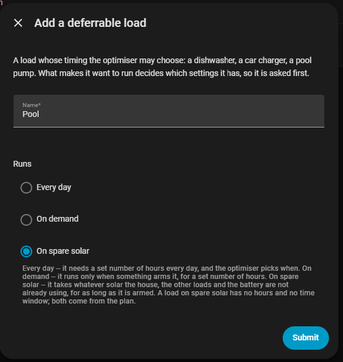

# Surplus loads

A "surplus load" isn't a separate thing you add — it's a deferrable load
with **Runs** (or **Recurrence**) set to **On spare solar**:

See **[Deferrable loads](deferrable_loads.md)** for how to add and configure
one. This page covers the extra sensors that appear once you have at least
one.

!!! note "Spare solar is a Companion feature"

    EMHASS has no spare-solar mode of its own — there's no setting for it in
    the EMHASS add-on's configuration and nothing in the EMHASS documentation
    that describes one, so don't go looking for a switch on that side. The
    Companion works out how long the day's spare solar can run the load for and
    then asks EMHASS for it as an ordinary deferrable load. Everything on this
    page is configured here, in the Companion.

## On the load itself

- **14. Energy needed** — an optional total cap, in kWh. 0 means no cap —
  the load takes whatever spare solar is going for as long as it's armed.
- **15. Spare solar headroom** — extra margin, in W, above the load's own
  draw before a moment counts as "spare" for it.
- **16. Surplus priority** — with more than one spare-solar load, the lower
  number gets first claim.
- **Start as early as possible** (switch) — see [below](#start-as-early-as-possible).
- **Spare solar budget** (diagnostic sensor) — how many hours the last plan
  allowed this load to ask for.

## Start as early as possible

Off by default. It decides **when in the day** an armed load gets its spare
solar — not how much it gets, which is always however much is going.

Off, the optimiser picks the moment. If you asked for less energy than the day
has sun for, it has room to choose, and nothing in it prefers the morning. So
the run can land in the afternoon.

On, the load starts as soon as there's spare solar and runs from there.

!!! note "It gives up a few per cent of the sun"

    Asking for *all* the spare solar there is already means the whole sunny
    stretch, which leaves no room in the day to move the run into. So a load
    with this switch on deliberately claims a little less than the day offers —
    between 5% and 25%, more when the run is short — and spends that slack on
    starting earlier.

    You do not have to configure this, and it is the reason the switch works
    with **14. Energy needed** left at 0. If you do set *Energy needed*, that
    number is delivered in full: it is already less than the day has going, so
    it needs no slack of its own.

    The margin buys most on a day whose sun tails off and nothing at all on a
    flat one, where the run fills the block whatever you do.

**Off is usually the better setting.** Early sun is thin, and a car charger
asking for 6 kW at nine in the morning will take what solar there is and buy
the rest from the grid. Turn this on when you want the energy *early* more
than you want it *cheap* — the car leaves at lunchtime, or you don't trust
the forecast.

It never runs the load without spare solar. "As early as possible" means as
early as the sun allows, not before it.

This is also why a spare-solar load has no working **Run now** button — that
one ignores the plan entirely, which here would mean running off the grid at
night. This switch is the version that keeps the solar condition.

## On the hub device

Once any load is set to *On spare solar*, these sensors appear:

- **Spare solar** (sensor) — spare power right now, with the full forecast
  in its `forecast` attribute.
- **Spare solar energy** (sensor) — kWh of spare solar still ahead in the
  plan's horizon.
- **Spare solar from** / **Spare solar until** (sensors) — the start and end
  of the current reporting window.
- **Spare solar** (binary sensor) — on when spare solar is above the
  reporting threshold, below.
- **Spare solar threshold** (number) — what counts as "spare" for these
  reporting sensors. This is display-only — it doesn't change what any load
  actually gets; each load uses its own headroom setting for that.
