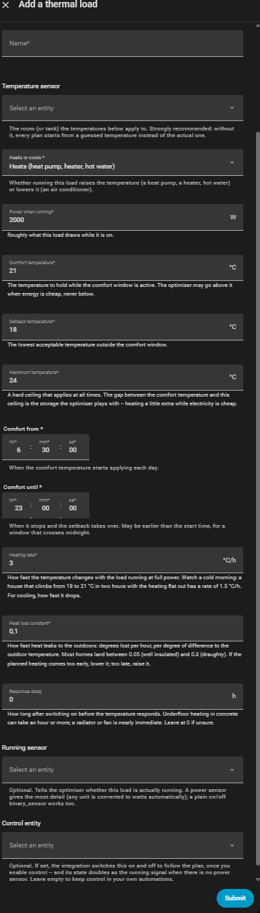
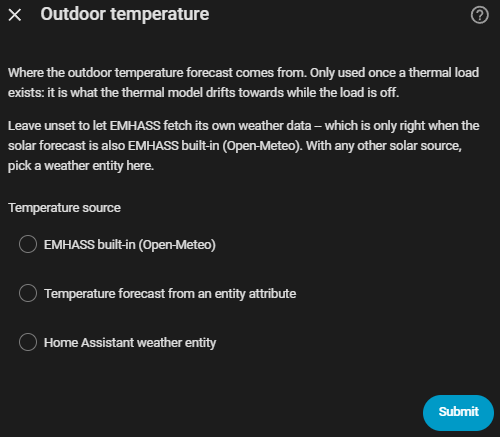

# Thermal loads

A thermal load is like a deferrable load, but its **temperature** is
controlled instead of its run time — a heat pump, direct electric heating,
an air conditioner. Add one from **Settings → Devices & Services → EMHASS
Companion → Add thermal load** — a separate button from *Add deferrable
load*.

## Add a thermal load

- **Name**
- **Temperature sensor** — the room (or tank) the settings below apply to.
  Strongly recommended: without it, every plan starts from a guessed
  temperature instead of the real one.
- **Heats or cools** — whether running the load raises the temperature (a
  heat pump, a heater) or lowers it (an air conditioner).
- **Power when running** — roughly what it draws while on, in W.
- **Comfort temperature** — the temperature to hold while the comfort
  window (below) is active. May go above this when electricity is cheap,
  never below.
- **Setback temperature** — the lowest acceptable temperature outside the
  comfort window.
- **Maximum temperature** — a hard ceiling, at all times.
- **Comfort from** / **Comfort until** — when the comfort temperature
  applies each day. May cross midnight.
- **Heating rate** — degrees per hour at full power.
- **Heat loss constant** — degrees lost per hour, per degree of difference
  to the outdoor temperature.
- **Response delay** — how long after switching on before the temperature
  responds. An hour or more for underfloor heating in concrete, 0 for a
  radiator or fan.
- **Running sensor** — optional; tells the optimiser whether the load is
  actually running.
- **Control entity** — optional; if set, the integration switches this on
  and off to follow the plan, once you turn control on.

## Its own device page

Every answer above becomes a setting on the load's device page, changeable
any time. A thermal load also keeps the same **Enabled**, **Run now**, time
window (**Earliest start** / **Latest finish** / **Restrict to a time
window**), **Most starts per plan** and **Cost of starting** settings as an
ordinary deferrable load — but has none of the run-time-target settings
(*Hours needed per day*, *Must run in one unbroken block*, *Recurrence*,
*Requested*), since its demand is the comfort band, not a number of hours.

It also gets one extra sensor:

- **Planned temperature** — the room temperature the plan currently expects,
  with the full forecast in its `forecast` attribute.

## Outdoor temperature

Once you have at least one thermal load, **Configure → Outdoor
temperature** appears, asking where the outdoor temperature forecast comes
from — it's what the room drifts towards while the load is off. A source is
required:

- **Home Assistant weather entity** — hourly forecast via
  `weather.get_forecasts`. Pick one that actually offers hourly data; daily or
  twice-daily forecasts are too coarse to schedule heating against.
- **Temperature forecast from an entity attribute** — for a weather
  integration that exposes its forecast as a list-valued attribute instead of
  through an action, or a template sensor you build yourself.
- **EMHASS built-in (Open-Meteo)** — no weather integration or API key
  needed, but requires your home's location to be set correctly under Home
  Assistant's Settings → System → Home information, and is only correct when
  the solar forecast is also EMHASS built-in.

## Getting the numbers right

Start with the defaults and adjust from what you observe:

- Plan heats **too early** → heat loss constant too high, or heating rate
  too low.
- Comfort **missed** at the start of the window → heating rate too
  optimistic, or the response delay is real and set to 0.
- The plan never pre-heats → widen the gap between comfort and maximum
  temperature; that gap is what it has to play with.
