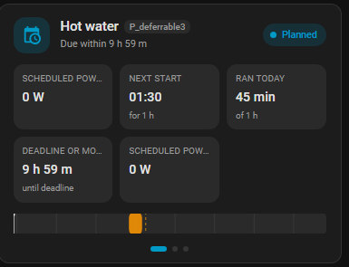
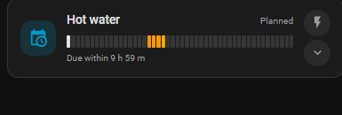
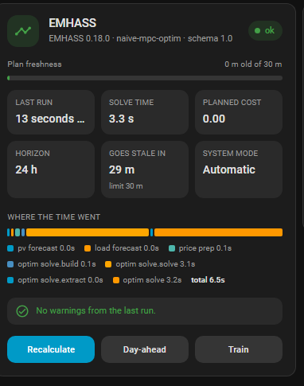
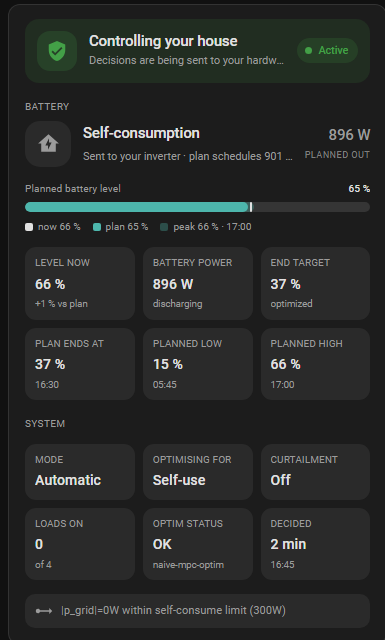
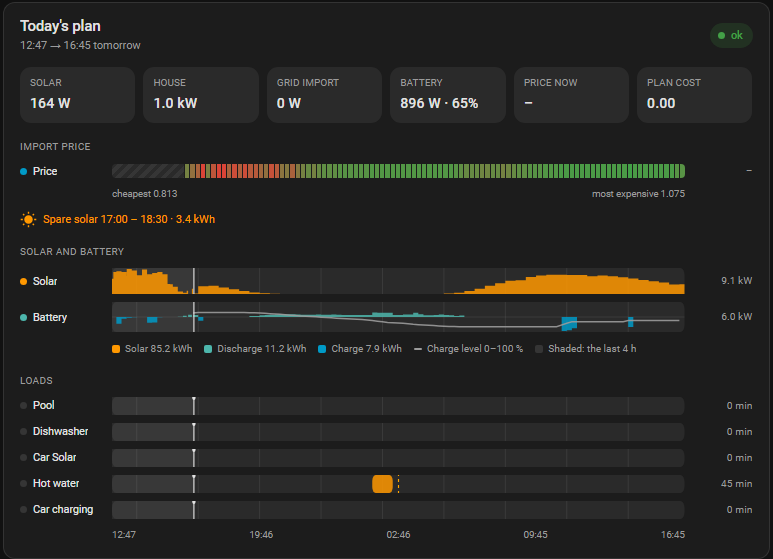

# Lab cards (experimental)

Five card designs that are being tried on real dashboards before any of them
replaces what [Dashboard cards](dashboard_cards.md) documents. They ship in
their own bundle, `frontend/emhass-cards-lab.js`, registered as a second
Lovelace resource alongside the stable one — so an experiment cannot break a
card an existing dashboard depends on, and the whole set can be withdrawn by
deleting one file and one entry in `frontend.py`'s `BUNDLES`.

They appear in the card picker as "EMHASS … (lab)". None of them is stable:
names, options and behaviour will change, and the ones that do not earn their
place will be deleted outright.

## Two takes on one deferrable load

Both keep the existing card's top half — name, `P_deferrableN` slot,
status, and the numbers — and differ in what they do with the space below it,
which today is a fixed list of entity rows.

Each takes an optional `load:`, matched against the load's name (the device
name). Left out, they show the first load.

### Swipe — `emhass-deferrable-swipe-card`



Three swiped pages under a shared header, on CSS scroll snapping — the browser
does the physics, so there is no carousel library and no drag handling to get
wrong. Dots below double as buttons on a desktop.

- **Now** — scheduled power, next start, runtime today, and either the
  deadline or the recurrence, over a plan track.
- **Control** — Requested, Run within / Energy needed, and a full-width
  **Run now**. Only the rows that mean something for the load's mode appear.
- **Plan** — a taller track with hour ticks, plus every run window written out
  as `13:30 – 15:30 · 3.0 kW`.

**Enabled** is not on this card or the strip below, for the same reason it is
not on the [shipping card](dashboard_cards.md): it takes the load out of the
optimisation entirely, which is a setup decision rather than a daily one. The
header still reads "Disabled" while it is off.

```yaml
type: custom:emhass-deferrable-swipe-card
load: Hot water
```

### Strip — `emhass-deferrable-strip-card`



One load in the height of a tile, for a dashboard that lists eight of them.
The day is drawn as 48 fixed-width buckets rather than proportional blocks, so
a load that switches twenty times and one that switches twice have the same
visual density. Two pinned round sub-buttons run it now and open a drawer with
Requested and Run within in it.

```yaml
type: custom:emhass-deferrable-strip-card
load: Hot water
```

## Three status cards

### `emhass-health-card` — is the optimiser healthy



Almost everything here already exists as attributes on **Optimisation status**,
where nobody looks: the run's duration, its stage-by-stage breakdown, the
EMHASS version that answered and the warnings it collected.

- A freshness meter reading the plan's age against `stale_after`, so "out of
  date" is a bar approaching a limit rather than a boolean that flips.
- Last run, solve time, planned cost, plan horizon — plus **two more boxes you
  choose**, see below.
- `stage_times` as one stacked bar — the only question asked of stage timings
  is which stage dominates, which is a length.
- Warnings and `error_message`, or an explicit "no warnings" when there are
  none.
- Buttons for **Recalculate now**, **Rebuild day-ahead** and **Train load
  forecaster**.

Every section can be turned off from the card's own **visual editor** — no
YAML needed. The switches write only what is off, so the config stays short:

```yaml
type: custom:emhass-health-card
title: EMHASS
show_stages: false
```

| Option | Default | Hides |
| --- | --- | --- |
| `show_freshness` | `true` | the plan-freshness meter |
| `show_stats` | `true` | the whole row of info boxes |
| `show_stages` | `true` | the stage-timing bar and its key |
| `show_problems` | `true` | the warnings and errors |
| `show_actions` | `true` | the three buttons |

#### The two chosen boxes

Boxes five and six of the row are picked from a dropdown, since the four fixed
ones already answer "did the run go well" and what is worth having beside that
answer differs per house. They default to **Goes stale in** and **System
mode** — both context the card could not show before rather than a second copy
of something it already does. Set either to **Nothing** and it is not drawn at
all, rather than drawn empty.

```yaml
type: custom:emhass-health-card
box_5: slowest_stage
box_6: price
```

The choices are `goes_stale`, `action`, `version`, `warnings`,
`slowest_stage`, `mode`, `goal`, `control`, `soc`, `end_soc`, `battery`,
`battery_action`, `solar`, `house`, `grid`, `price`, `sell_price`, `surplus`,
`plan_end`, `steps`, `loads` — and `none`. Each carries a second line saying
what its value is measured against ("limit 30 m", "charging", "12 min apart"),
and tapping one opens the entity behind it.

#### Filtering the back-fill warning

A day-ahead price source does not publish tomorrow until early afternoon, so
the payload extends the tail of the horizon by repeating the previous day's
prices — and says so, every run, for well over half of every day. It is
correct and expected, and a warnings box that carries it permanently is one
the eye learns to skip, including on the day something real turns up in it.

**Hide price back-fill warnings** in the editor drops it, and only it: the
other short-series warning ("EMHASS will hold the last value for the
remainder") means a forecast genuinely ran out and always stays. What was
filtered is still counted on the card, so a silenced warning never looks like
a clean run.

```yaml
type: custom:emhass-health-card
hide_fill_warnings: true
```

### `emhass-status-card` — what it is doing to the house



Status only: there is not a switch, chip or slider on it. The dry-run gate and
the system mode are the two settings most easily changed by accident from a
phone in a pocket, and a card that is glanced at many times for every time it
is operated is the wrong place to keep them. Tapping any icon opens the
entity, so the settings are one tap away rather than absent.

- A banner that goes **green only when the Companion is actually in charge** —
  control enabled *and* the last decision applied. The gate shut reads "Dry
  run / Watching", a failed command turns it red, and enabled-but-quiet reads
  "Armed / Standby" with the reason spelled out (see below).
- The battery decision with its reason and its power, and — separately —
  whether the command actually went out. A decision that is already in force
  is not re-sent every run, so "already in effect" and "not sent" are
  different states and the card says which.
- **Planned battery level** on one rail: the plan's level now as the fill, the
  peak still to come as a lighter band beyond it, the lowest level still to
  come as a tick, and the *measured* level as a marker. A visible gap between
  marker and fill is a plan running on a stale SOC, which no single-value
  display can show; the low tick is the other half of the same question, since
  a plan that ends the day full can still empty the battery on the way, and it
  turns red when the trough goes under 20 %.
- Value boxes under **Battery** — the measured level with its gap to the
  plan, battery power with its charge/discharge sense, the end SOC target
  against where the plan actually ends, and the planned low and high with the
  times they fall.
- Value boxes under **System** — mode, cost function, curtailment, how many
  deferrable loads the decision has switched on, how the last optimisation run
  ended, and how long ago the decision was taken.
- The executor's own `rules` for the current decision, and its `error` if
  there is one. The error is never hidden, whatever the card is configured
  down to.

#### What "Armed" means

Armed is the enabled-but-quiet case, and it has two quite different causes, so
the banner names which one it is instead of saying "nothing to apply":

- **"Already where the plan wants it — nothing to re-send"** — commands *were*
  resolved for this decision, and none of them was worth sending: the inverter
  is already in that mode at that power, and every load is already in the state
  the plan asks for. This is the normal steady state of a working system, not a
  fault. The executor only writes when the action changes, when the power moves
  past the deadband, or when a time-limited command is about to lapse.
- **"No inverter command for this decision"** — nothing was resolved at all,
  which means no inverter profile is set up, or the profile defines no action
  for what was decided. Loads are still switched; the battery is not being
  touched. See [Inverter control](inverter_control.md).

#### The decision's power

The big figure beside the decision is labelled with *which* power it is:

- **charging now / discharging now / now** — the live reading from the battery's
  own power sensor. Preferred over everything below it, and the direction is
  named whenever the Companion is the one that was told which sensor to read,
  since only then is its sign convention known.
- **target** — the power the last command carried, for a forced charge or
  discharge, when there is no live sensor to read.
- **planned in / planned out** — the plan's own figure for this moment, as a
  last resort.

Live first, because the two below it describe an intention rather than an
outcome. A target outlives its command: the decision taken at the top of the
quarter hour is still the last decision after the executor has stopped the
battery, so a stale "2.7 kW" would sit beside a battery at rest. And a
**self-consumption** decision carries no target at all — the point of it is
handing the battery back to the inverter to follow the house, so the executor
sends a zero that means "not my number", which printed as power reads as a
battery doing nothing at the moment it is usually working hardest.

#### Measured entities: usually nothing to set

The card draws the measured battery against the planned one, so it needs to know
which of your sensors those are. It asks the Companion, not you: the integration
is already configured with both — **Battery SOC sensor** and **Battery power
sensor**, under Settings → Battery — and publishes them as attributes on its own
planned sensors, where every card can find them.

So on a configured install this section is empty. The two options below exist to
override that per card, for pointing one card at a different meter:

| Option | Used for |
| --- | --- |
| `soc_entity` | The measured level: the marker on the rail, the "now" legend, and the gap in **Level now**. Left unset, the Companion's own SOC sensor is used; with neither, the marker is not drawn. |
| `power_entity` | The live battery power, for the decision's power. Left unset, the Companion's own battery power sensor is used — which is also what lets the card say *charging* or *discharging* rather than only how hard, since the Companion is told which way that sensor counts and a card option is not. |

Both are read directly, so they update live rather than at the optimiser's
cadence.

#### Choosing what to show

Every block and every value box can be turned off from the card's own **visual
editor** — no YAML needed. The switches write only what differs from the
default, so the config stays short:

```yaml
type: custom:emhass-status-card
show_rules: false
```

| Option | Default | Hides |
| --- | --- | --- |
| `show_banner` | `true` | the control banner |
| `show_decision` | `true` | the battery decision, its reason and its power |
| `show_soc` | `true` | the planned battery level rail |
| `show_battery` | `true` | every tile under **Battery** |
| `show_system` | `true` | every tile under **System** |
| `show_rules` | `true` | the executor's rule trace |
| `show_level` | `true` | Level now |
| `show_power` | `true` | Battery power |
| `show_target` | `true` | End target |
| `show_plan_end` | `true` | Plan ends at |
| `show_low` | `true` | Planned low |
| `show_high` | `true` | Planned high |
| `show_mode` | `true` | Mode |
| `show_cost` | `true` | Optimising for |
| `show_curtail` | `true` | Curtailment |
| `show_loads` | `true` | Loads on |
| `show_optim` | `true` | Optim status |
| `show_decided` | `true` | Decided |
| `show_commands` | **`false`** | — set it to `true` to *show* the command count |

**Commands** is the one tile that starts off. It counts the service calls the
decision resolved to, which answers "what would actually be sent" while an
inverter profile is being set up and nothing much afterwards. **Optim status**
took its place in the default layout: it is the state of the last EMHASS run,
and everything else on the card is downstream of it — a decision taken off an
infeasible or failed run is still reported confidently, and that tile is what
says not to trust it. The health card above has the full account.

Values in the tiles are written to fit 84 px: "Maximize self-consumption"
appears as **Self-use**, "Maximize profit" as **Max profit**, "Minimize cost" as
**Min cost**, and **Decided** counts in `3 min` / `2 h` rather than "3 minutes
ago", with the wall-clock time underneath. A truncated value is not a value.

### `emhass-overview-card` — the household, on one axis



The plan card answers "what will the power do". This answers "why", by putting
the import price, the solar forecast, the battery and every load on the *same*
time axis, in rows that start and end on the same pixel. The price is a colour
ribbon rather than a line: what everything else is being compared against is
only ever "is this hour cheap", and one dimension fits in colour. A load block
under the greenest part of the ribbon, or a charge block under the fattest part
of the solar curve, is the optimiser explaining itself.

- **Info boxes** — six value boxes, each set from a dropdown (see below).
- **Import price** — the ribbon, with the cheapest and most expensive values
  under it. Hours the market has not published yet are hatched rather than
  coloured: for most of the morning the plan runs past the last known price,
  and a colour there would be an invention.
- **Spare solar** — the surplus window and its energy, when there is one.
- **Solar** — the forecast as a filled profile.
- **Battery** — the planned power, drawn from a centre line: discharge above
  it in the battery colour, charging below it in the accent. The planned
  **charge level** rides over the lane as a thin 0–100 % line, so the cause
  (a charge block) and the effect (the level rising) are read together.
- **Loads** — one lane per deferrable load, as before.

The figure on the right of the solar and battery lanes is that lane's **peak**,
since a profile has no y-axis of its own; the energies are spelled out in the
key underneath. Any row opens its entity when tapped.

Every section can be turned off, from the card's own **visual editor** — no
YAML needed. The switches write only what is off, so the config stays short:

```yaml
type: custom:emhass-overview-card
title: Today's plan
show_stats: false
```

| Option | Default | Hides |
| --- | --- | --- |
| `show_stats` | `true` | the whole row of info boxes |
| `show_price` | `true` | the price ribbon and its scale |
| `show_surplus` | `true` | the spare-solar line |
| `show_solar` | `true` | the solar lane |
| `show_battery` | `true` | the battery lane |
| `show_soc` | `true` | the charge-level line over the battery lane |
| `show_loads` | `true` | the per-load lanes |

A lane with no data behind it hides itself regardless — a house without a
battery does not get an empty battery row.

The six info boxes are set individually, from **Info boxes** in the editor or
as `tile_1` … `tile_6` in YAML. Each caption follows its own value, so a box
set to `grid` reads "Grid import" or "Grid export" depending on which way the
power is going. A box set to `none` is not drawn at all, and the five
remaining ones spread to fill the row.

| Value | Shows |
| --- | --- |
| `none` | nothing — the box is left out |
| `solar` `house` `grid` `battery` | the four live power readings (the default first four) |
| `soc` | the planned charge level now |
| `end_soc` | the end-of-horizon charge target |
| `price` `sell_price` | import and export price for the current slot |
| `cost` | what the plan is expected to cost |
| `solar_planned` `charge_planned` | kWh of solar, and of charging, across the plan |
| `surplus` | the spare-solar energy |
| `loads` | how many deferrable loads are on, of how many |
| `age` | how long ago the last successful optimisation ran |

#### The window

The card draws a **rolling window**: two hours back from now, out to the end of
the plan. It rolls with the clock, so the present is always at the same place
and the part of the plan that can still be changed always has the same width.

The alternative — drawing whatever extent the data happens to have — puts the
start at last midnight, because that is where a day-ahead price sensor begins
publishing. At noon that is a third of the card spent on a morning nobody can
do anything about. The heading under the title is that window, with the end
labelled by day when it crosses midnight, so `09:26 → 11:00 tomorrow` cannot be
misread as a morning.

The past is shaded on every lane, and spent price cells are faded. Set
`history_hours: 0` for a card that starts at now.

#### What the historic side is drawn from

The plan is no help behind the present — an MPC run begins at the timestep it
was made in — so the solar and battery lanes fill their historic side from the
**recorder**, in one call, refreshed at most once a minute.

By default that is the Companion's own sensors: the solar lane's past is *the
forecast the plan was using at the time*, and the battery lane's past is the
power the plan had for that moment. No configuration, and the battery's sign
convention is known to be the plan's.

Point it at the house's own meters instead to see what actually happened,
which is the more interesting comparison — the shaded side then disagrees with
the plan when reality did:

```yaml
type: custom:emhass-overview-card
history_hours: 3
solar_entity: sensor.inverter_pv_power
battery_entity: sensor.inverter_battery_power
invert_battery: true
```

| Option | Default | Does |
| --- | --- | --- |
| `history_hours` | `2` | how far back the window reaches; `0` starts at now |
| `solar_entity` | — | measured solar power for the historic side |
| `battery_entity` | the Companion's **Battery power sensor** | measured battery power for the historic side; set only to draw this card from a different meter |
| `invert_battery` | `false` | for a sensor that is positive while *charging* — the card draws positive as discharge, following the plan. Read only when `battery_entity` is set; the Companion carries its own convention |

Each lane's tooltip names which record its shaded side is, since a forecast and
a meter reading look identical once they are drawn. A sensor the recorder
excludes simply leaves that lane starting at now.

The load lanes have no historic side yet: they show the plan only, so their
shaded part is the plan as it stood, not what the loads did.

## Notes for anyone editing these

- Same constraints as the shipping bundle, on purpose, so a design that wins
  moves across unchanged: plain custom elements, inline SVG, no Lit, no build
  step, ES2017 only — no optional chaining, no nullish coalescing. Both are
  checked by `tests/test_packaging.py`.
- Unlike the shipping cards, these build their DOM once and update it in
  place. A rebuild on every `hass` object would throw away the element under a
  finger mid-drag, several times a second.
- Hub entities are looked up by `domain.translation_key`, not by
  `translation_key` alone: `solar_surplus` is published twice, once as a
  sensor and once as a binary sensor.
- Colours come from Home Assistant's own theme variables. Every `color-mix()`
  is preceded by a flat `rgba()` fallback, so a browser without it keeps a
  usable grey instead of rendering nothing.
- The health, overview and status editors are built on `ha-form`, which no card
  can import: it arrives with whichever built-in card editor the frontend
  happens to have loaded. `loadHaForm()` forces that by creating an `entities`
  card and asking it for its own editor, then waits on
  `customElements.whenDefined`.
- Both editors are driven by the same list the card builds itself from —
  `OVERVIEW_SECTIONS`, `STATUS_SECTIONS` and `STATUS_TILES`. A block added to
  one of those lists appears in its editor without the editor being touched,
  which is the only way the two stay in step. Editors write back only what
  differs from the default, so the YAML never fills with `show_x: true`.
- A card whose `setConfig` runs again rebuilds its DOM (`LabCard` clears
  `_built`), so a section the config removes is genuinely absent rather than
  hidden. That is why every `update()` on the status card writes through
  `setBox`, which no-ops on a box that was never built.
