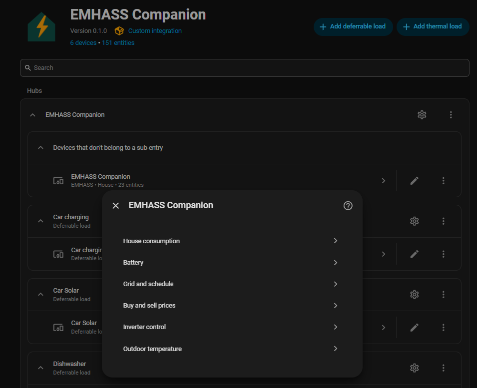
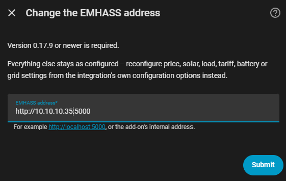
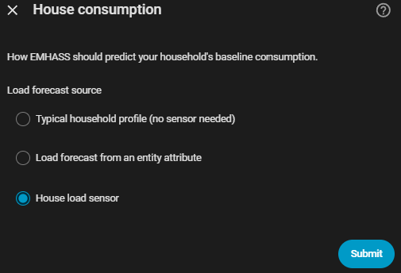
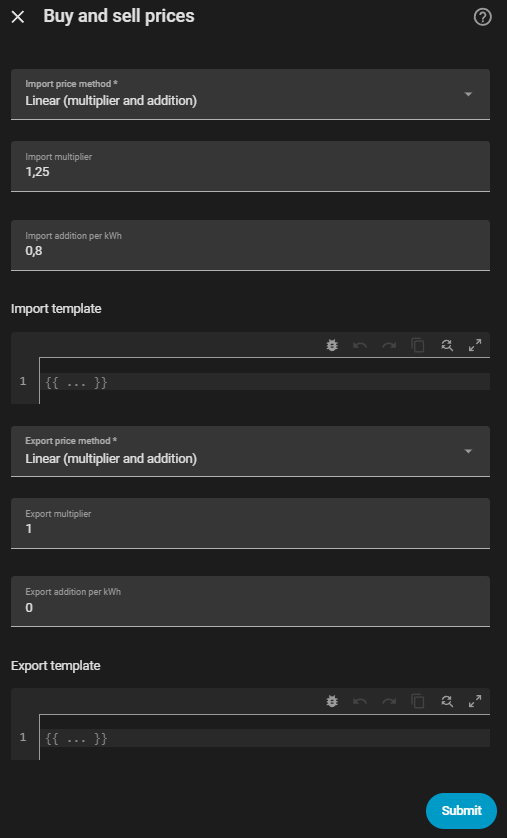
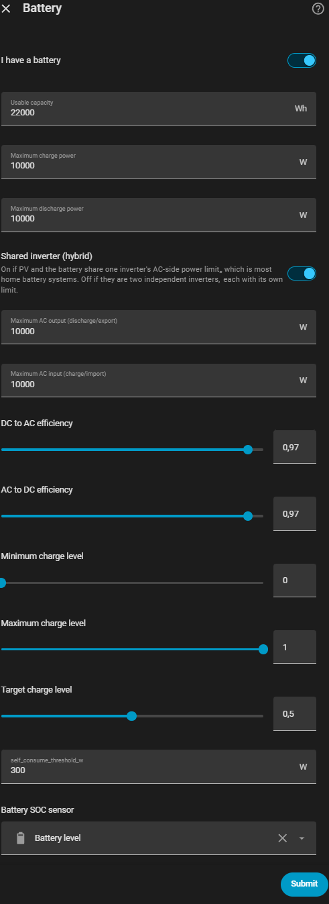
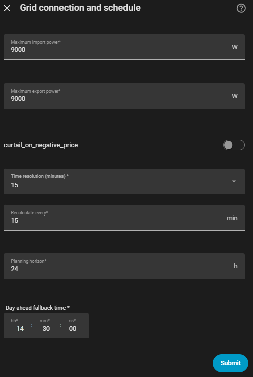

# Setup

The config flow asks a few questions at a time, and **only ever offers data
sources you actually have installed**.

| Step | What it asks |
|---|---|
| Connect | Where EMHASS is |
| Electricity prices | Which price source, and its settings |
| Buy and sell prices | What your supplier and grid operator add on top of spot |
| Solar forecast | Which forecast source — or *No solar* |
| House consumption | Which sensor, and how to forecast from it |
| Battery | Capacity and limits — or leave it off |
| Inverter control | Which profile writes the plan to hardware — or none, and stay read-only |
| Grid and schedule | Connection limits, curtailment, time resolution, how often to recalculate |

Most of these can be revisited any time from **Settings → Devices & Services
→ EMHASS Companion → Configure**:

**Inverter control** is the same step as during setup — come back here to add
a profile you skipped, or to swap one. **Outdoor temperature** is only worth
visiting once you have a thermal load. Both are covered in
[Inverter control](inverter_control.md) and
[Thermal loads](thermal_loads.md) rather than here.

The electricity price source is the one thing asked only during initial setup
— changing which *source* you use means removing and re-adding the
integration, since it decides which other questions even apply. The solar
forecast source can be changed from **Configure → Solar forecast**.

## Connect

The first question, during initial setup, is simply where EMHASS is. The
add-on's address is filled in automatically if it's running; otherwise
enter it yourself (for example `http://192.168.1.10:5000`). Note that
`localhost` only ever reaches Home Assistant's own container, never the
machine or sibling add-on EMHASS runs in.

If EMHASS itself moves — a new host, a different port — change just that
via the integration's **Reconfigure** option, without touching anything
else you've configured:

## House consumption

How EMHASS should predict your household's baseline load:

- **Typical household profile (no sensor needed)** — a generic shape scaled
  to an average power you enter. See [Data sources](data_sources.md).
- **Load forecast from an entity attribute** — the escape hatch for any
  integration exposing a forecast as a list attribute.
- **House load sensor** — a real power sensor, most accurate once you have
  one that excludes your own deferrable loads.

## Buy and sell prices

Price sources return **raw spot prices**. Composing your real prices happens
separately, because tariff structures differ enormously between markets and
change from year to year. Three modes, chosen independently for import and
export:

- **Linear** — `spot × multiplier + adder`. Use the multiplier for VAT and the
  adder for grid fees, energy tax and supplier markup.
- **Already includes costs** — some price integrations can bake fees in
  themselves. If yours does, use this and do not add them twice.
- **Template** — a Jinja template with `spot` and `time` (a local-time
  `datetime`) available, for tiered or time-of-day structures.

> Tax and subsidy schemes change. Nothing here is kept current for you — check
> your own numbers each year.

## Battery

Leave **I have a battery** off and everything else on this step is ignored —
the optimiser plans around PV, load and price alone.

| Setting | Meaning |
|---|---|
| Battery SOC sensor | Read at the start of every run so the plan starts from reality |
| Usable capacity | In Wh |
| Maximum charge / discharge power | The battery's own limits |
| Minimum / maximum charge level | The optimiser will not plan the battery outside this range |
| Target charge level | Where the optimiser aims to leave the battery at the end of the horizon. What it means depends on End SOC below |
| End SOC | How that end-of-horizon level is chosen. See below |
| Shared inverter (hybrid) | On if PV and the battery share one inverter's AC-side power limit — true for most home battery systems. Off if they are two independent inverters, each with its own limit |
| Maximum AC output / input | Only asked if hybrid — the shared inverter's own throughput ceiling, separate from the battery's own charge/discharge limits |
| DC to AC / AC to DC efficiency | Conversion losses, only asked if hybrid |
| Discharge / charge cycle cost | What a kWh through the battery costs in wear. See below |
| Low / high charge comfort level | Levels the plan prefers to stay between, softly. See below |
| Cost of sitting below / above it | What that preference is worth, per kWh past the level per hour |
| Stress cost detail | How finely the stress cost curve is approximated — 10 is a good balance |
| High-power stress cost | Discourages fast charge/discharge, growing with the square of the power. See below |
| Self-consumption handoff threshold | See below |
| Live PV power sensor | Optional. See "Blending live PV/load into MPC" below |

**Discharge cycle cost / charge cycle cost.** A battery that is worked hard
wears out sooner, and a plan that only reads prices will happily cycle for a
one-cent spread. These two put a number on that wear: a cost per kWh of
throughput, in the same currency as your prices, charged against the profit the
optimiser is trying to maximise. The plan then cycles only when the spread it
is chasing clears the cost.

Both default to **0** — EMHASS's own default, meaning cycle freely — so leaving
them alone changes nothing. A rough starting point for the discharge cost is
the battery's price divided by its warranted lifetime throughput, which usually
lands somewhere around 0.02–0.10 per kWh.

Set *one* of the two unless you know why you want both. The usual choice is the
discharge cost, priced for the whole round trip; filling in the charge cost as
well charges every stored kWh twice, which is a legitimate thing to want but
rarely what people mean.

**Charge comfort levels.** Two soft preferences about where the battery *sits*,
as opposed to the cycle costs above, which price how much energy moves through
it. Each is a threshold plus the price of being past it, charged per kWh beyond
the level for every hour spent there:

- **Low charge comfort level** / **cost of sitting below it** — nudges the plan
  to keep a reserve instead of running near empty.
- **High charge comfort level** / **cost of sitting above it** — sitting at
  full charge ages a lithium battery faster, so this pushes the plan to fill
  the battery late rather than early when the two cost the same.

These are preferences, not limits. Minimum and maximum charge level are hard
bounds the optimiser may never cross; these bend the plan and can always be
overridden when the economics clearly justify it, which also means they can
never make a plan infeasible.

Both costs default to **0**, which is what keeps the pre-filled 40% and 90%
thresholds inert — EMHASS only builds the constraint once the matching cost is
above zero, so the thresholds alone change nothing.

**High-power stress cost.** Discourages hammering the battery at full power.
The cost grows with the *square* of the power, so running at half power costs a
quarter as much, and the plan spreads a charge across several hours instead of
forcing it all into the single cheapest one. Priced per kW at full power, per
hour; **0** (the default) turns it off. It needs a non-zero charge or discharge
power limit above to do anything.

**Stress cost detail** is how finely EMHASS approximates that curve, in straight
line segments. Higher tracks the true cost more closely but adds constraints to
every optimisation; **10** is a good balance, and it only matters when the
stress cost is set.

**End SOC.** Which battery level the plan is required to reach at the end of
the horizon — the single constraint that decides whether an overnight
discharge is allowed to run the battery down, or has to leave it charged for
tomorrow. Three modes:

- **Optimized** — computed fresh each run from the solar, price and load
  forecasts *beyond* the horizon. Target charge level then acts as a reserve
  floor the computed target never plans below.
- **Same as start** — always plans back to the level the battery is at now.
  The old fixed behaviour.
- **Fixed % slider** — always aims for Target charge level exactly.

Requires EMHASS 0.18 or newer. The resulting target, and the reasoning behind
it, is published on the **End SOC target** sensor. See
[End SOC](end_soc_plan.md) for how *Optimized* decides.

**Self-consumption handoff threshold.** When the plan's grid power is within
this many watts of zero, the battery is handed to the inverter's own
self-consumption mode instead of the plan's forced charge/discharge — even a
large planned charge or discharge is overridden, because self-consumption
tracks real-time PV and load better than a forecast can at small imbalances.
Once handed over, grid power must exceed **twice** this value before the plan
can force the battery again, so it doesn't flip modes every recalculation.
This is not the same as the charge-level limits above, which only bound what
the optimiser may plan *between*.

Actually commanding the battery is a separate step — see
[Inverter control](inverter_control.md).

### Blending live PV/load into MPC

An MPC run's very first forecast step covers the next few minutes, which a
live sensor reading knows better than any forecast. If a **Live PV power
sensor** is set here, its current reading is blended into the first step of
every MPC PV forecast. Load is blended the same way automatically whenever
the load profile is **House load sensor** (Configure > House consumption) —
that profile already asks for a live load-power sensor, so nothing extra is
needed for it.

How much either blend trusts the live reading over the forecast is the
**Live value weight** number entity on the EMHASS Companion device (a slider
from 0 to 1): 0 uses the forecast untouched, 1 replaces the first step
entirely with the live reading, and 0.5 — the default — splits it evenly.
Day-ahead runs are never blended; a day-ahead forecast starts at midnight, not
now.

## Time resolution

The **Grid and schedule** step defaults the optimisation time step to whatever
your chosen price source actually publishes at — Nord Pool has been 15-minute
since October 2025, most other sources are still hourly — detected
automatically, not something you have to work out yourself. Change it if
you'd rather trade detail for a faster solve; it isn't limited to a fixed
list, type any number of minutes.

This is only the *resolution EMHASS plans at*. How often the plan is
recalculated (below) is a separate setting.

**Capacity (demand) charge**, also on this step, is for network tariffs that
bill the highest power you draw rather than only the energy you use. Enter the
price per kW and the plan starts flattening its single worst import peak —
spreading deferrable loads apart and discharging the battery across the peak —
instead of only chasing cheap hours. It is charged once on that peak, not per
hour, so it is the one cost here that is not an energy price.

This is a grid setting, not a battery one: peak shaving works through
deferrable loads too, so it applies whether or not you have a battery. **0**
(the default) turns it off entirely.

**Let EMHASS optimise PV curtailment**, on the same step, is off by default.
It is EMHASS's own `compute_curtailment`, sent with every run rather than left
to the add-on's stored configuration, and it is the only curtailment switch
there is. With it on, the plan gains a PV-curtailment column and the executor
turns that into an export cap for an inverter profile that supports one; with
it off, nothing curtails at all.

Turn it on only if something can act on it. Without a curtailment-capable
inverter profile, the plan assumes solar was shed that in reality still flows
to the grid — a plan you cannot execute is worse than one that never tried.
Negative sell prices are part of what EMHASS weighs here: it decides for
itself when exporting into one is worse than shedding, and when it isn't.

## Scheduling

Two cadences:

- **Model-predictive** — re-optimises from the current state every 15 minutes
  by default.
- **Day-ahead** — a full plan across the whole horizon.

The day-ahead run is **event-driven, not a fixed clock time**. It fires when
the price series actually gains a new day. Markets publish at different hours
and publication slips; a fixed time means quietly optimising against
yesterday's prices whenever it does. A configurable fallback time exists as a
backstop.
