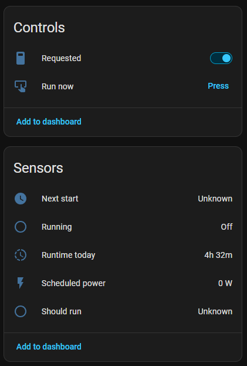
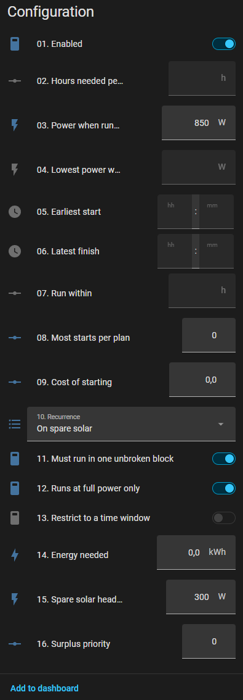
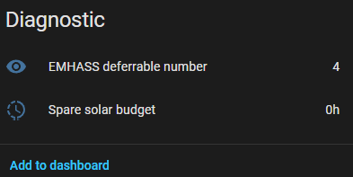

# Surplus loads

A load that only ever wants energy which would otherwise leave the house.

The motivating case is a pool heater: 800 W, on or off, and worth running only
when the sun is producing more than the house and its other deferrable loads
need. There is no deadline, no target run time and no "hours per day" — it
takes what is spare for as long as it is armed. *When* it may run is decided
without any regard for the battery or the grid — see [the add-back](#the-add-back)
for why — but *how much* it is asked for still leaves room for the battery to
reach its own target first; see [the battery reservation](#the-battery-reservation).

This is a **Companion construct**, not an EMHASS feature — see
[why this cannot be an ordinary deferrable load](#why-this-cannot-be-an-ordinary-deferrable-load).

Choose *On spare solar* under **Runs** when adding the load, then arm it with its
**Requested** switch. Turn the switch off to stop. That is the whole
user-facing feature, plus one optional switch —
[Start as early as possible](#start-as-early-as-possible) — for a load you
want served at the front of the sun rather than wherever the day suits it
best.




Adding a deferrable load asks two questions first — its name and what makes it
want to run — because that answer decides which settings it even has. A config
flow cannot show or hide a field in reaction to another field in the same form,
and a surplus load has no operating hours and no time window to offer. An
existing load can be switched over at any time with its `recurrence` select.

## Why this cannot be an ordinary deferrable load

**There is no surplus mode in EMHASS.** No self-consumption mode either, and no
config option, payload field or API endpoint that corresponds to one — nothing
in EMHASS's own configuration, the add-on's options, or the upstream docs will
match anything on this page, and looking for it there is a dead end. Everything
described here is computed by the Companion; what EMHASS is finally sent for a
surplus load is a completely ordinary deferrable load with an hours target and a
window, indistinguishable from any other.

EMHASS's cost function is imports minus export revenue. It has **no value term
for consumption at all**, so any load it is not forced to run is pure cost and
the solver sets it to zero at every timestep. There is no way to express "run
this if it happens to be free" in the MILP.

The only lever is `def_total_hours`, which is a hard constraint. So a surplus
load's run time has to be computed outside the optimiser, from the surplus the
plan itself predicts, and handed back as an ordinary hours target.

## How the budget is derived

Once per run, in `surplus.py`, from the **previous** run's plan:

1. **The series.** `max(0, P_PV - P_load - ordinary deferrables)` — PV the
   house and its *ordinary* scheduled deferrables don't need, plus the surplus
   loads' own `P_deferrable` added back (see below). Deliberately not
   `-p_grid`: what the battery charges on, or what gets exported, is the
   optimiser's call about where to put spare PV, not a statement about
   whether there was any. Reading `-p_grid` instead would let the battery
   silently outrank every surplus load for the same watt, any time it still
   has room to charge.
2. **The current block.** From here to the first stretch that can't even feed
   the load's run floor — the run floor being its nominal power when it can
   only be on or off, and its minimum power when it can modulate. A horizon
   that starts mid-morning also reaches past sunset into tomorrow's sunrise;
   without this cut, the block would splice today's tail onto tomorrow's,
   and everything below would be sized against a "day" that is really two
   days with a night spliced out of the middle.
3. **Qualifying timesteps**, within that block. Those where the surplus is at
   least the run floor plus *headroom* — measured after any higher-priority
   surplus load has taken its draw, but before the battery's own reservation
   is taken off (see below).
4. **The window.** First to last *gross*-qualifying timestep *in the block*,
   sent as an absolute `start_at`/`end_at` pair rather than a wall-clock one.
5. **The budget.** `hours = credited energy / nominal power`, capped at the
   qualifying span itself. Each qualifying timestep's *full* surplus is
   credited (not clipped at what the load can draw in that one slot), so a
   run of strong slots can cover for a few that only just clear the bar —
   but the total can never ask for more hours than the span physically has
   room for, which is the cap doing the same job the per-slot clip used to.
   See [the budget cap](#the-budget-cap) below.

The load is then sent to EMHASS as a completely ordinary deferrable with those
hours and that window. The optimiser still decides *when* inside it — but only
inside it, and [Start as early as possible](#start-as-early-as-possible)
narrows the window until there is no *inside* left to decide, on the loads
where it can. Without the block cut, a window spanning a whole night is still a
technically valid window, and EMHASS will place the load at 3 a.m. if that
happens to be the cheapest way to fill it — solar never entered its decision,
only the (wrongly wide) window did.

### The add-back

Only *ordinary* deferrables are subtracted from `P_PV - P_load`. Every surplus
load's own `P_deferrable` is left out of the subtraction entirely, which makes
the series **invariant to whether those loads are scheduled**: a surplus load
that is currently running must not see its own draw counted against next
cycle's budget, or it would switch itself off every time it switched on. An
ordinary deferrable's consumption stays subtracted because it is a real claim
on the house's energy — leaving it out too would promise the same
kilowatt-hour to the pool as well, selling it twice.

### The budget cap

Each qualifying timestep credits what it can still hand over — everything the
sun offered there, less the battery's reservation and less what the
higher-priority surplus loads already took — and not just what this load could
draw in that one slot: a 3 kW timestep credits an 800 W pool the full 750 Wh,
not 200 Wh. That lets a run of strong slots make up for a few that only just
clear the bar, or for a slot the battery reserved most of, rather than every
single timestep having to individually justify itself before it counts at all.

The total is then capped at the qualifying span itself: the load can never be
asked to run more hours than the span has timesteps for, because there would
be nowhere left to place the rest — EMHASS would report the whole problem
infeasible rather than just this one load. That cap is deliberately the
*tight* span (the last qualifying timestep's own interval, one step wide),
not the wider window sent to EMHASS — the window carries an extra step of
padding to absorb rounding in `payload.resolve_load_window`, and letting the
cap eat into that padding too would ask for a step nobody's surplus actually
backed. A capped variable load's own ceiling (see below) is subject to the
same cap, sized against `nominal_w` rather than against energy directly —
exact for a semi-continuous load, an accepted approximation for one that
modulates.

On an abundant day this converges on "run for the whole window" — a small
number of weak or reserved slots inside an otherwise strong block no longer
shrink `hours` at all, they just get absorbed by it. On a thin day it still
falls back to something close to the old per-slot count, because there is
no surplus elsewhere in the span to borrow from.

And below one timestep, the budget is dropped outright. EMHASS can only place
a load in whole timesteps — `payload.operating_timesteps` floors any non-zero
request at one — so a sub-step budget does not buy a shorter run, it buys a
*full* step at nominal power with only the fraction below it backed by
surplus. The rest is imported, which is the one thing a surplus load exists
not to do, so the choice is between one partial step and nothing at all. The
window is still reported: the sun was up, there was simply nothing left of it
worth a timestep. An explicit `max_energy_wh` is exempt — a small number the
user typed is still an instruction, and the rounding is warned about
separately.

## Start as early as possible

Off by default. On, the load takes the **front** of the sunny stretch instead
of leaving EMHASS free to place its hours anywhere inside it.

It changes the window and nothing else — not the hours, not the energy, not
which timesteps were credited. The budget is already "however much the surplus
supports"; all this decides is where in the block those hours land.

### The modulation pad

The window is a fixed span, not something derived from the block's shape:

```
run_steps = ceil(hours / step)
margin    = clamp(1 / run_steps, 5%, 25%)
pad_steps = max(1, round(hours * margin / step))
window_last = window_first + (run_steps - 1 + pad_steps) * step
```

`hours` and `energy_wh` are untouched — the switch has never changed the
budget, only where it may land, and that is still true. What changed is how
`window_last` is found. `pad_steps` reuses the run-length scaling `hours`
itself used to be derated by: a short run needs proportionally more shaping
room than a long one, because it averages fewer slots and so is more exposed
to any single one coming in under forecast. A four-step run gets a quarter
of its own hours back as padding; a twenty-step run a twentieth. It exists
for the same reason it always has: a load pinned to exactly its bare hours
would have to hold the block's *peak* power through every one of them, and
the front of a block is usually its weakest end — EMHASS treats the energy
total as an equality, so a window with no room to spread the run down a ramp
just imports the difference instead. The pad is what buys the solver
somewhere to shape the run into.

**This used to be derived from the block's deliverable energy instead** —
walking slot by slot from `window_first` until cumulative delivery covered
the ask, on the theory that this was the earliest window EMHASS could fill
without importing. That walk is gone. The reason: "deliverable" is net of
whatever the battery's own charging already claims from the same slots
(`battery_reserved_series`, below), and that claim is read from the
*previous* MPC cycle's plan — it is not a constraint this cycle's solve is
bound to keep. A block whose early slots the battery has already claimed
read, to the walk, as if the sun did not rise until the battery was done
with it: on a car charging off a battery that still has most of its SoC to
find, the walk would reach past two or three hours of genuine sun the
battery was mid-claim on, and hand back a window starting whenever that
claim happened to taper off — the exact opposite of "as early as possible",
and for a reason (a stale reservation) the running solve was always free to
override by simply charging the battery later instead.

The fixed span trusts that instead: it does not know or care what the
battery reserved last cycle, so the window opens at the first *gross*-
qualifying slot and holds for `run_steps + pad_steps`, regardless of how
much of that span the previous plan had already spoken for. **This is a
bet, not a guarantee.** If the current solve does not, in fact, reschedule
the battery's charging to make room — some other constraint holds it where
it was — EMHASS imports for the shortfall in that window, the same way any
ordinary deferrable would on a day the forecast came in wrong. That is an
accepted cost, scoped to the one window on the one day the bet doesn't pay
off; the alternative (waiting for the walk to catch up with wherever the
battery's claim happens to end) reliably produces exactly the late start
this switch exists to avoid.

### What it does in practice

A pool needing 2.5 h (10 steps) inside four hours of flat 800 W sun: the
window closes 12 steps after it opens — ten steps of run, one of padding
(`clamp(1/10, 5%, 25%) = 10%`, `2.5 h × 10% ≈ 1 step`), one more that
`window_end` always carries against payload rounding. Switch off, EMHASS
gets the full 21-step block to place the same run in instead.

A load whose early slots the battery has claimed almost entirely — 200 W of
3000 W left over each, say, in the first four of an eight-slot block — asks
for its energy as usual and gets a window that opens right there anyway: the
four reserved slots still count as gross-qualifying, so `window_first` sits
at the front of them regardless of how little they can currently deliver.
Whether that resolves to a clean early start or a slot or two of import
comes down to whether the running solve actually moves the battery's charge
elsewhere — which is between EMHASS and the battery, not something this
budget can see in advance.

**It is still usually the worse choice for self-consumption**, and that is
the point of leaving it off by default. Pulling the window in buys the run
somewhere to shape itself and a real shot at running earlier, but it cannot
conjure sun that isn't up yet, and now it can also ask for a slot the
battery genuinely still needs. Turn it on when you want the energy *early*
more than you want it *cheap* or *free of import* — a car leaving at noon, a
battery you are content to have charge later in the day instead — not as a
general improvement.

A widened window is logged at debug level, naming the load and how many
timesteps it grew by; a run that starts later than expected on a peaked day
is usually this. It is also how to confirm the uncapped case above — a line
widening the window back to the full block, run after run, means the switch is
doing nothing:

```
01KZF7RZDVQXFMCGJD9ZFNBT74: start-as-early-as-possible window widened from 21
to 38 timesteps -- the front of the block cannot deliver 36607 Wh at 7022 W
without importing
```

This is also why **Run now** is unavailable on a surplus load. That button
forces the load on regardless of the plan, which here means charging off the
grid at midnight, and it clears itself against an `operating_hours` a surplus
load structurally does not have — so once pressed it stayed on until Home
Assistant was restarted. This switch is the honest version of the same intent.

The load is still surplus-gated throughout: the window can never open before
the first qualifying timestep, so "as early as possible" means early within
the sun, never before it. And because the whole budget is rebuilt from
scratch every cycle, a run cut short by cloud is not a request spent — a
later cycle simply derives a fresh window from whatever sun is left.

### The battery reservation

The window is gross, but the *hours* asked for are net of one more thing: what
the battery's own charging already claims from the same slot, read straight
from the previous plan's `P_batt` (`battery_reserved_series` in `surplus.py`).
That plan was solved honouring `battery_target_state_of_charge` already — SOC,
timing, price, efficiency, all of it — so reusing its own charging schedule is
both simpler and more faithful than re-deriving "energy still needed to reach
70 %" from SOC and capacity here and risking it disagreeing with what EMHASS
actually intends to do.

This narrows `hours`, never the window and never which timesteps qualify: a
slot the battery is charging hard on is still qualifying, so it still counts
towards *when* the load may run, it just may contribute little or nothing
towards *how much*. Keeping the two separate is what stops this turning back
into the `-p_grid` bug — a battery that is still short of its target must not
be able to push the load's start out, only to leave it fewer hours once it's
running.

That separation is also what keeps the budget from oscillating, and it is a
subtler point than it looks. The reservation is read from a plan the load was
already *in*, and that plan charged the battery on precisely the PV the load
did not take — so in every slot the load is running, gross minus the
reservation comes back as the load's own draw and nothing more. Qualify a slot
on that residual and it can never clear the load's own run floor *plus
headroom*, so the whole block drops out, the budget collapses to zero, the
battery reclaims the block, and the next cycle hands back a full budget again:
a two-cycle oscillation between "all of it" and "none of it". Headroom is
margin against the *forecast* being wrong; measuring it against a residual the
load's own consumption is already inside of is a category error.

Sharing among multiple surplus loads (priority order, see above) is the claim
that *does* gate qualification, because a load that is running really has
emptied the slot. Each load in turn is measured against what its seniors left,
and credits what is left of that after the reservation.

### A currently-running unbroken load whose window moved on

*Must run in one unbroken block* (`single_constant`) and the surplus window
interact badly if left alone. EMHASS pins a currently-on single-constant load
to run from t=0 for its full requested duration and widens the window mask to
fit — an unbroken block can't be split, so it just lets an in-progress one run
to completion rather than interrupt it. That is correct when the window still
covers now: the pin is simply continuing the block that opened it. It is wrong
when the block that justified starting has ended and the window has moved to
a later, unrelated one (this page's motivating case: dishwasher claims the
last of today's sun, and the next real block is tomorrow) — the pin would
still fire, off the *new* block's fresh multi-hour total, starting immediately
on grid or battery power the load was never meant to draw.

Because a surplus load always reports zero completed timesteps (see below),
there is no "remaining" figure for EMHASS's own progress tracking to release
it with, either — every cycle re-pins a full fresh block, so left alone this
does not merely run once, it can keep re-arming indefinitely.

The fix is in `payload._describe`: when a load is both `current_state` (really
running) and `single_constant`, and its freshly-resolved window's start index
is past zero, its hours are sent as 0 for that request instead of the later
block's total. With no operating requirement, EMHASS has nothing to pin and is
free to plan the load off starting now. The later block is asked for normally
on its own cycle, once "now" actually reaches it and `current_state` has had
the chance to catch up. A load that has not started yet is unaffected — its
future window is the ordinary, correct way to ask for it — and so is a
non-single-constant load, which only ever gets a one-timestep force-on from
EMHASS's current-power pin, not a multi-hour one.

### Why the previous plan

This is a lagged single pass. Solving twice per cycle — once to find the
surplus, once with the load in it — would feed the second solve's output back
into its own input, and the budget would oscillate between runs. Using the last
plan costs one MPC interval of lag on a load that heats a swimming pool, and
the whole budget is recomputed from scratch every cycle, so an error corrects
itself immediately.

Before the first optimisation after a restart there is no plan, so the budget is
empty and the load is parked. It picks up on the next run.

### Why no completed timesteps

`def_current_operating_timesteps` is sent as **zero** for a surplus load.

The budget is derived from the *forward* surplus, which shrinks on its own as
the day's sunny timesteps fall behind the horizon — so the hours being sent are
already "what is left". Letting EMHASS subtract completed timesteps as well
double-counts every hour served: a pool two hours into a four-hour surplus
would be told it needs two more hours and has already done two, and would stop
at noon with half the sun still ahead of it.

`def_current_state` is still sent, so a running load is not charged a startup
penalty twice.

## Settings



Greyed-out fields above are the ones a surplus load has taken over — see the
table below for exactly which.

| Setting | Surplus load |
| --- | --- |
| Power when running | **configured** — the load's rating, and its run floor when on/off |
| Runs at full power only | **configured** |
| Lowest power while running | **configured**, when the above is off |
| Cost of starting | **configured** |
| Energy needed | **configured** — optional cap, 0 for none |
| Spare solar headroom | **configured** |
| Surplus priority | **configured** — only matters with more than one surplus load |
| Hours needed per day | *derived* |
| Restrict to a time window | *derived* |
| Run within | not applicable |

The two power settings are the same pair every deferrable load has, and they
interact the same way: with *Runs at full power only* on, the load is either off
or at its nominal power, and *Lowest power while running* is not read.

They also decide what `nominal_w` the budget is divided by (see
[the budget cap](#the-budget-cap) above), which is easy to get wrong:

- **Full power only** — the load draws exactly its nominal power whenever it
  runs, so `hours` is credited energy divided by that fixed figure, capped at
  the qualifying span. A timestep offering 3 kW still only ever draws the
  pool's 800 W once it's actually running — the 3 kW is credit *towards how
  many hours it may run*, not power it will actually pull in that one slot.
- **Variable** — the same division and cap, but against a ceiling that
  adapts to the day (below) rather than a fixed one.

  The *ceiling* EMHASS is given for the run is not always the configured
  nominal power, either. It is clamped down to the best surplus actually seen
  in a qualifying slot this run — so an 11 kW charger on a 3 kW day is sent as
  a 3 kW load, not an 11 kW one. Without that clamp, `hours` is computed
  against a ceiling the day cannot reach, which understates the hours needed
  and leaves EMHASS free to run near the unreachable ceiling for a short
  burst instead of at the achievable power for the whole window — importing
  the difference either way. The configured value is still a hard cap in the
  other direction: the clamp only ever pulls the ceiling down, never raises
  it past what the appliance can actually take. A full-power-only load has no
  ceiling to clamp — it is always either off or at its configured power.

### Headroom

The margin a timestep must clear *above* the load's own draw before it counts.

Its main job is absorbing PV forecast error: a slot counted at exactly the
load's power imports the moment the forecast comes in light. It also opens a
band — between the load's power and the load's power plus the headroom — of
timesteps that do not add to the budget but are still safe to run *through*,
because the load's draw still fits inside the surplus there.

That band is why **Cost of starting** is the right way to keep an on/off load
from short-cycling, rather than *Must run in one unbroken block*. A startup
penalty prices each start, so EMHASS runs one contiguous block on a clear day
(splitting costs the penalty and buys nothing) and splits across two peaks on a
broken-cloud day (straddling the gap costs more than the penalty). One unbroken
block is a hard constraint, and on a day with a deep midday gap it will drive
the load through that gap and import to satisfy itself.

### Energy needed

A total, not a rate: "put 20 kWh in the car and stop". Zero means no cap, which
is the pool's case and the default.

Progress is tracked locally against the current request and subtracted from the
cap; it is never sent to EMHASS (see above). When the cap is met the request
disarms itself. Without a cap the load stays armed until the switch is turned
off — a temperature limit is then an automation that turns the switch off, not a
feature of the load.

The cap is exact for a full-power load, where delivered energy is runtime times
nominal power. For a variable-power load it over-states delivery whenever the
load modulates below nominal, so the cap is reached early and the load stops
short rather than over-running.

## Several surplus loads

They share one series, allocated by **Surplus priority** (lower claims the
series first, ties broken by name), with each load's draw subtracted from what
the next one sees.

Without that every surplus load reads the same number, all of them are told the
whole surplus is theirs, and running two together imports the difference. The
optimiser cannot arbitrate it, because none of these loads is in the plan the
budget was derived from.

Priority only matters once there are two or more surplus loads competing for
the same series — with a single one there is nothing to be first *ahead of*.
Every load defaults to the same priority, so nothing changes until you set one
lower than another's — a car charger given a lower number than a pool, say,
takes what it needs first and leaves the pool whatever surplus is left.

## What is published

On the hub device:

- `sensor.…_solar_surplus` — spare solar now, with the whole series in
  `forecast` and the reporting window in the attributes
- `sensor.…_solar_surplus_energy` — kWh still ahead in the horizon. Usually the
  more useful trigger: whether to start heating a pool is a question about
  kilowatt-hours coming, not watts at this instant
- `sensor.…_solar_surplus_start` / `_end` — the reporting window's ends
- `binary_sensor.…_solar_surplus` — above the reporting threshold now
- `number.…_surplus_threshold` — what those four call a surplus

That threshold is **reporting only**. No load budgets against it: a load's own
threshold is its run floor plus its own headroom, because "is there enough spare
sun for the pool" and "…for the car" are different questions.

The two "now" entities read `unknown`, never zero, when there is no plan
covering this moment — a made-up zero is indistinguishable from a real "the sun
has gone in", and anything you gate on it would switch off on the strength of a
missing reading. A numeric-state trigger ignores `unknown`, so this is usually
what you want. Note that a new plan's horizon starts at the *next* timestep
boundary, leaving the minutes since the run finished uncovered; the last reading
of the outgoing plan is carried across that seam, so it is not a source of
`unknown` in normal running.

Per load, `sensor.<load>_surplus_budget` reports the hours the last run was
allowed to ask for, with the window, the energy, the qualifying threshold and
any remaining cap as attributes. A load that is not running is either short of
surplus, short of headroom, or was beaten to it by a higher-priority load, and
those look identical from the outside without it.



Also diagnostic: `sensor.<load>_emhass_deferrable_number` — see
[on-demand loads](on_demand_loads.md#deferrable-numbering-stays-stable) for
why it stays stable.

## What this is not

Exported power is worth the sell price, so consuming it here forgoes that
revenue — it is not free energy, it is simply the only energy no other part of
the plan has already claimed. On a tariff where selling pays more than the load
is worth to you, a surplus load is a bad trade, and nothing here will notice.
